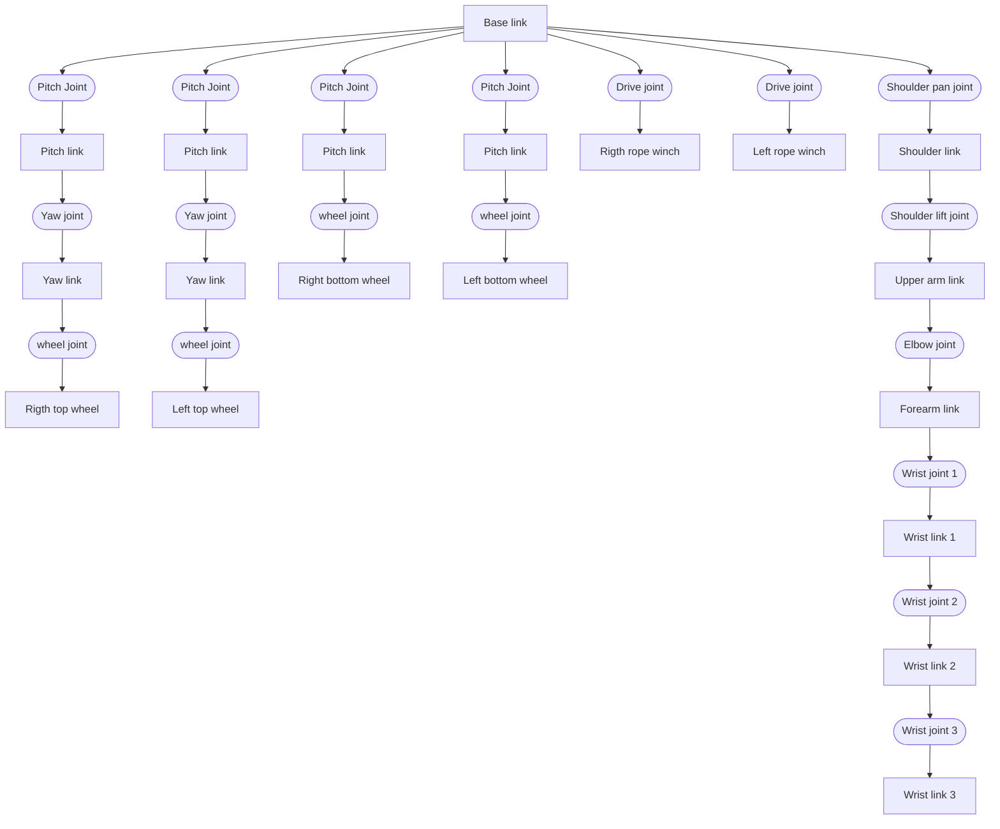

```mermaid
flowchart TD
    chs[Base link]
    
    rdj([Drive joint])
    ldj([Drive joint])

    rtpj([Pitch Joint])
    ltpj([Pitch Joint])
    rbpj([Pitch Joint])
    lbpj([Pitch Joint])

    rtwj([wheel joint])
    ltwj([wheel joint])
    rbwj([wheel joint])
    lbwj([wheel joint])

    rtyj([Yaw joint])
    ltyj([Yaw joint])

    rtpl[Pitch link]
    ltpl[Pitch link]
    rbpl[Pitch link]
    lbpl[Pitch link]

    rtyl[Yaw link]
    ltyl[Yaw link]

    rdl[Rigth rope winch]
    ldl[Left rope winch]

    rtw[Rigth top wheel]
    ltw[Left top wheel]
    rbw[Right bottom wheel]
    lbw[Left bottom wheel]

    spj([Shoulder pan joint])
    slj([Shoulder lift joint])
    ej([Elbow joint])
    w1j([Wrist joint 1])
    w2j([Wrist joint 2])
    w3j([Wrist joint 3])

    sl[Shoulder link]
    ual[Upper arm link]
    fal[Forearm link]
    w1l[Wrist link 1]
    w2l[Wrist link 2]
    w3l[Wrist link 3]

    chs --> spj
    spj --> sl
    sl --> slj
    slj --> ual
    ual --> ej
    ej --> fal
    fal --> w1j
    w1j --> w1l
    w1l --> w2j
    w2j --> w2l
    w2l --> w3j
    w3j --> w3l


    chs --> rtpj
    rtpj --> rtpl
    rtpl -->rtyj
    rtyj --> rtyl
    rtyl --> rtwj
    rtwj --> rtw

    chs --> ltpj
    ltpj --> ltpl
    ltpl -->ltyj
    ltyj --> ltyl
    ltyl --> ltwj
    ltwj --> ltw

    chs --> rbpj
    rbpj --> rbpl
    rbpl -->rbwj
    rbwj --> rbw

    chs --> lbpj
    lbpj --> lbpl
    lbpl -->lbwj
    lbwj --> lbw


    chs --> rdj
    rdj --> rdl

    chs --> ldj
    ldj --> ldl

```